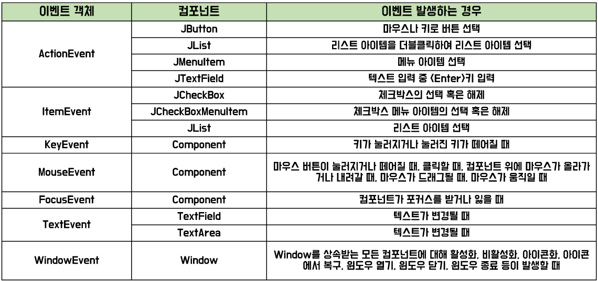

[comment]: <> (## OhppajiOh)

[comment]: <> (https://www.figma.com/proto/N24CiFPJiBiv9xoXQgwmk5?kind=&node-id=180:282&scaling=min-zoom)

# GUI
- GUI(Graphical User Interface): 그래픽 이미지를 사용하여 컴퓨터와 사용자가 의사소통 하는 사용자 인터페이스(UI)를 말함
- AWT(Abstract Window Toolkit): GUI 프로그래밍(윈도우 프로그래밍)을 위한 도구로 다양한 컴포넌트를 제공 
  Java로 구현하지 않고 OS의 컴포넌트를 그대로 사용하는 것이 특징
- Swing: AWT를 확장한 GUI 프로그래밍 도구 
         AWT보다 더 많은 종류의 컴포넌트를 제공 
         OS의 컴포넌트를 사용하지 않고 순수 Java로 구현한 것이 특징 
         클래스명 앞에 J를 붙여서 AWT와 구분

<b>컨테이너</b>
- 다른 컴포넌트를 포함할 수 있는 GUI 컴포넌트
- 다른 컨테이너에 포함될 수 있음
- 다른 컨테이너에 속하지 않고 독립적으로 존재 가능
- 스스로 화면에 자기 자신을 출력하는 컨테이너로는 JFrame, JDialog, JApplet이 있음

<b>컴포넌트</b>
- 컨테이너에 포함 되어야 화면에 출력될 수 있는 GUI 객체
- Java.awt.Component 클래스는 모든 GUI 컴포넌트의 최상위 클래스
- Swing 컴포넌트의 최상위 클래스는 javax.swing.JComponent

### 컨테이너와 컴포넌트의 포함관계

# 이벤트 처리

### 이벤트 기반 프로그래밍
- 이벤트의 발생에 의해 프로그램 흐름이 결정
- 이벤트 발생 시 이벤트를 처리하는 루틴(이벤트 리스터)이 실행

### 이벤트의 종류
1. 사용자의 입력: 마우스 드랙, 마우스 클릭, 키보드 누름 등
2. 센서의 입력: 네트워크로부터 데이터 송수신
3. 다른 응용 프로그램이나 다른 스레드로부터의 메시지

### 이벤트의 흐름

### 이벤트의 클래스 계층 구조

<b>이벤트 객체와 컴포넌트</b>

